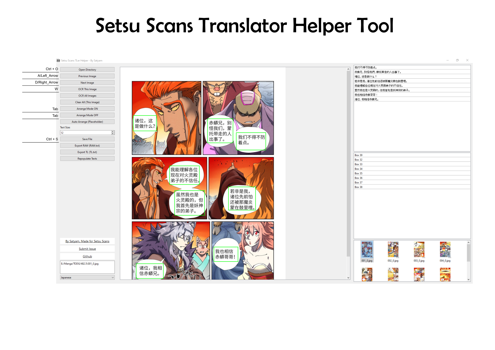
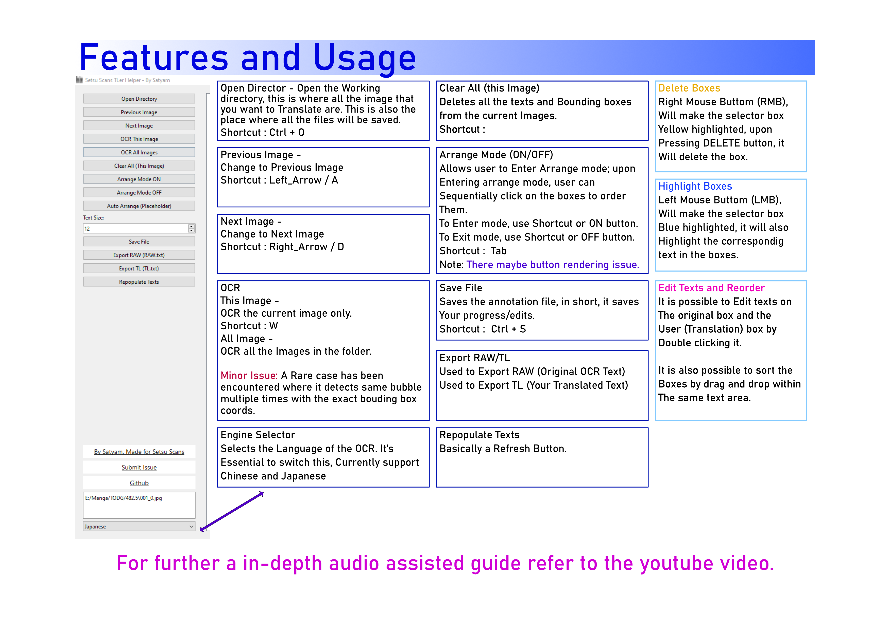

# Setsu Scans Translator Helper Tool (Early Release)
## Refer to the Youtube Video for Usage Guides


## :bar_chart:Future Updates
:green_book: Option to turn off AI Engines

:green_book: Option to Enable AI Translation

:green_book: Comic/Manga/Manhua Text Box Auto Arrange

:grey_question: UI Improvements

## :wrench: Installation (For now please refer to the For Experienced section, need to make Install properly.bat)

The code in this repo is essentially for CPU usage only, it is working very good on my i5 11400, so I think it'll work great on your PC too.

```
git clone https://github.com/SatyamSSJ10/SetsuScansHelper
cd ./SetsuScansHelper
git clone https://huggingface.co/SatyamSSJ10/SSHelper
```
### Auto Install is not properly set up, so you need to have some experience.

### For Experienced
So, what we're dealing with here is Pytorch and Transformers, so install those and then leave the rest to requirements.txt. If you want, you could set up an environment (preferred). Get help of ChatGPT if you don't know what you are doing.

Also, we're using a custom EasyOCR module here 
```
git clone https://github.com/SatyamSSJ10/EasyOCR
cd ./EasyOCR
pip install .
cd ../
rmdir /Q /S EasyOCR
pip install -r requirements.txt

```

## :space_invader: Running
if you're using venv just enter it and run (use Powershell)
```
./venv/Scripts/Activate.ps1
python main.py
```

Else just 

```
python main.py
```


